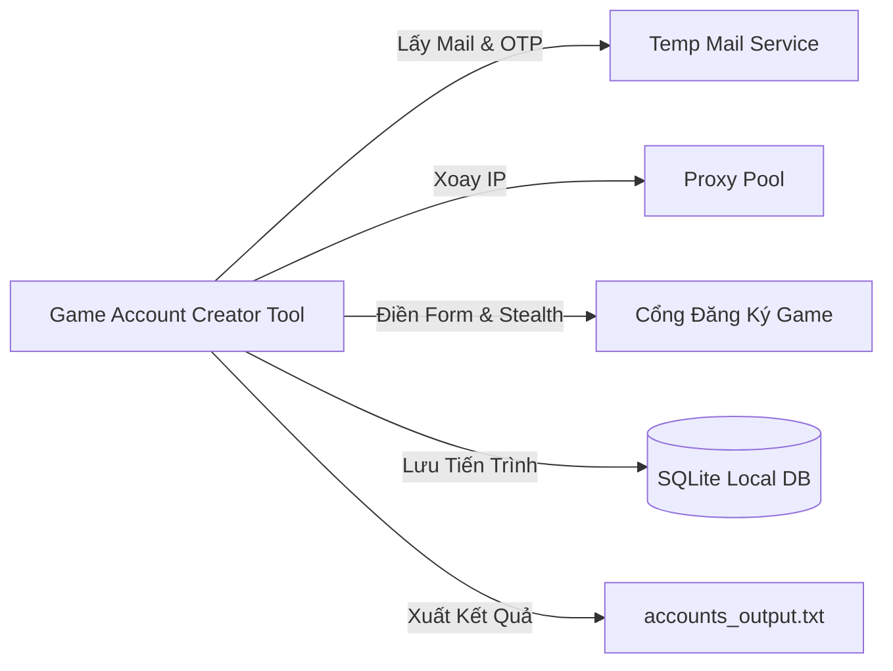

# Đặc Tả Yêu Cầu Phần Mềm (Software Requirements Specification - SRS)

**Dự án**: Game Account Automation Engine (GameAccAuto)  
**Phiên bản**: 1.0.0  
**Ngày cập nhật**: 2026-09-21  

---

## 1. Giới thiệu (Introduction)

### 1.1 Mục đích (Purpose)
Tài liệu này đặc tả toàn bộ yêu cầu nghiệp vụ, chức năng và phi chức năng cho hệ thống **Game Account Automation Engine** - công cụ tự động hóa quy trình khởi tạo tài khoản hàng loạt cho các cổng phát hành game, tích hợp hệ thống lấy email ảo tự động, bóc tách mã xác thực OTP, bảo vệ tài khoản khỏi các cơ chế chống bot (Anti-Ban / Anti-Cheat) và xuất kết quả quản lý chuẩn hóa.

### 1.2 Phạm vi Sản phẩm (Product Scope)
* **Trong phạm vi (In-Scope)**:
  * Tự động sinh tên tài khoản theo logic thứ tự tự tăng từ 1 đến 1000 kèm tiền tố linh hoạt.
  * Cấu hình mật khẩu mặc định hoặc theo quy tắc bảo mật tùy biến.
  * Quản lý hồ sơ cấu hình riêng biệt cho từng game (Multi-Game Roles/Profiles).
  * Tích hợp API dịch vụ Email ảo (Temp Mail REST API) có hạn sử dụng ngắn (~10 phút).
  * Tự động Polling hòm thư và trích xuất mã OTP hoặc đường link xác thực thông qua Regex.
  * Động cơ tự động hóa trình duyệt (Playwright Stealth Engine) để điền form đăng ký và xác nhận.
  * Cơ chế phòng thủ Anti-Ban: Xoay vòng IP bằng Proxy (Residential / 4G), giả lập vân tay trình duyệt (Fingerprint Spoofing), và mô phỏng hành vi người dùng thật (Human-like typing, delay jitter).
  * Lưu trữ bền vững tiến trình đăng ký vào SQLite (chống mất dữ liệu khi mất mạng hoặc crash).
  * Xuất dữ liệu tài khoản ra file văn bản `.txt` phân tách bằng dấu gạch đứng `|`.
* **Ngoài phạm vi (Out-of-Scope)**:
  * Không hỗ trợ bypass xác minh OTP qua SIM / SMS vật lý ở giai đoạn 1.
  * Không can thiệp đảo ngược mã nguồn (reverse engineer) nhị phân của client game chạy trên máy tính.

### 1.3 Thuật ngữ & Viết tắt (Definitions & Acronyms)
* **SRS**: Software Requirements Specification.
* **OTP**: One-Time Password (Mã xác thực dùng một lần).
* **Temp Mail**: Dịch vụ thư điện tử tạm thời, tự động tiêu hủy sau khoảng thời gian xác định.
* **Fingerprint**: Dấu vân tay thiết bị / trình duyệt (Canvas, WebGL, AudioContext, User-Agent).
* **Jitter Delay**: Độ trễ ngẫu nhiên được thêm vào giữa các hành vi để mô phỏng người thật.
* **Proxy Rotation**: Kỹ thuật xoay vòng địa chỉ IP mạng qua danh sách Proxy.

---

## 2. Mô tả Tổng quan (Overall Description)

### 2.1 Bối cảnh Hệ thống (Product Perspective)
Hệ thống là một ứng dụng tự động hóa độc lập (Automation CLI / Desktop Tool) giao tiếp với:
1. **Dịch vụ Temp Mail bên thứ ba**: Cung cấp hộp thư tạm và nhận email xác thực.
2. **Cổng Web Đăng ký của Game**: Điền thông tin và gửi yêu cầu đăng ký.
3. **Mạng lưới Proxy Pool**: Cung cấp địa chỉ IP sạch để tránh bị game chặn dải IP.
4. **Hệ thống Lưu trữ Cục bộ (Local Storage)**: File văn bản `.txt` và cơ sở dữ liệu `SQLite`.

### 2.2 Tác nhân & Đối tượng Sử dụng (User Classes)
* **Người vận hành (Operator)**: Người chạy công cụ, cấu hình dải số lượng (1 - 1000), thiết lập hồ sơ game, mật khẩu và proxy.
* **AI Agent (Antigravity)**: Đóng vai trò đồng hành bảo trì, thực thi các chu trình kiểm thử, tối ưu mã nguồn và nâng cấp tính năng.

### 2.3 Ràng buộc Kỹ thuật (Constraints)
* Môi trường chạy: Tương thích Windows / Linux / macOS.
* Ngôn ngữ nền tảng: Python 3.10+ (Playwright, Httpx, Asyncio, Pydantic, SQLite).
* Khả năng chịu lỗi: Có thể dừng và tiếp tục (Resume) bất cứ lúc nào mà không bị trùng lặp tài khoản.

---

## 3. Yêu cầu Chức năng (Functional Requirements)

### 3.1 Phân hệ Tạo Dữ liệu & Quản lý Hồ sơ Game (Generator & Profile Engine)
* `[US-GEN-01]`: Người dùng có thể cấu hình tiền tố (Prefix) và dải thứ tự bắt đầu - kết thúc (Ví dụ: từ 1 đến 1000). Hệ thống tự động sinh tên tài khoản tuần tự (Ví dụ: `player_0001` đến `player_1000`).
* `[US-GEN-02]`: Người dùng có thể thiết lập mật khẩu cố định mặc định hoặc bật chế độ sinh mật khẩu ngẫu nhiên có độ bảo mật cao (chữ hoa, số, ký tự đặc biệt).
* `[US-ROLE-03]`: Hệ thống hỗ trợ lưu trữ và chuyển đổi hồ sơ cấu hình (Game Profiles/Roles) theo từng game khác nhau (URL đăng ký, CSS Selectors, thời gian chờ).

### 3.2 Phân hệ Quản lý Email Ảo & Lấy Mã OTP (Temp Mail & OTP Service)
* `[US-MAIL-04]`: Hệ thống tự động kết nối qua REST API để tạo một địa chỉ email tạm thời mới (vòng đời tối thiểu 10 phút) cho mỗi tài khoản.
* `[US-MAIL-05]`: Hệ thống tự động Polling (thăm dò) hòm thư mỗi 3 - 5 giây với thời gian chờ tối đa (timeout) cấu hình được (mặc định 60 giây).
* `[US-MAIL-06]`: Hệ thống áp dụng Regex linh hoạt để tự động bóc tách mã xác nhận OTP (4 đến 6 chữ số) hoặc trích xuất đường dẫn kích hoạt (Activation URL).

### 3.3 Phân hệ Tự Động Hóa Đăng Ký (Registration Automation Engine)
* `[US-REG-07]`: Hệ thống tự động điều khiển trình duyệt truy cập trang đăng ký của game tương ứng với hồ sơ đã chọn.
* `[US-REG-08]`: Hệ thống tự động điền Username, Email ảo, Password và trường Confirm Password.
* `[US-REG-09]`: Hệ thống kích hoạt nút "Gửi mã xác nhận", chờ nhận OTP từ phân hệ Mail và tự động điền mã OTP vào ô xác thực.
* `[US-REG-10]`: Hệ thống thực hiện Submit form và kiểm tra trạng thái phản hồi để xác định đăng ký thành công hay thất bại.

### 3.4 Phân hệ Phòng Vệ Chống Ban & Anti-Detection (Security & Evasion)
* `[US-SEC-11]`: Hệ thống hỗ trợ tích hợp danh sách Proxy (HTTP/SOCKS5) và tự động xoay vòng IP sau mỗi N tài khoản thành công hoặc khi gặp lỗi rate-limit.
* `[US-SEC-12]`: Hệ thống áp dụng Playwright Stealth nhằm ẩn dấu các thuộc tính tự động hóa (`navigator.webdriver`, giả lập Canvas hash, WebGL vendor, AudioContext).
* `[US-SEC-13]`: Hệ thống mô phỏng hành vi con người: thêm độ trễ ngẫu nhiên (Jitter Delay 1s - 4s), tốc độ gõ phím tự nhiên (50ms - 150ms/ký tự).

### 3.5 Phân hệ Lưu Trữ & Xuất Dữ Liệu (Storage & Exporter)
* `[US-EXP-14]`: Khi đăng ký thành công, hệ thống lập tức ghi dữ liệu ra file văn bản `.txt` với định dạng phân tách bằng dấu gạch đứng `|`:  
  `username|password|email|game_name|status|created_at`
* `[US-EXP-15]`: Hệ thống đồng thời lưu trữ toàn bộ trạng thái (SUCCESS, FAILED, TIMEOUT) vào cơ sở dữ liệu `SQLite` cục bộ, hỗ trợ xem báo cáo thống kê và tiếp tục phiên chạy dang dở (Resume Feature).

---

## 4. Yêu cầu Phi chức năng (Non-functional Requirements)

### 4.1 Tính Ổn định & Chịu lỗi (Reliability & Fault Tolerance)
* Khi một tài khoản đăng ký thất bại do mạng hoặc timeout mail, hệ thống phải tự động thử lại tối đa 3 lần trước khi ghi nhận lỗi và chuyển sang tài khoản tiếp theo mà không làm crash toàn bộ tool.
* Khóa file (File locking) an toàn khi ghi dữ liệu nhằm chống hiện tượng tranh chấp dữ liệu (Race Condition) khi chạy đa luồng.

### 4.2 Hiệu năng (Performance)
* Hỗ trợ chế độ chạy đơn luồng (Single-thread) an toàn hoặc đa luồng có kiểm soát (Concurrency: 2 - 5 workers) tùy thuộc vào số lượng proxy sạch người dùng cung cấp.
* Mức tiêu thụ tài nguyên nhẹ, hỗ trợ chế độ Headless Browser để tối ưu RAM.

### 4.3 Khả năng Dễ Theo Dõi (Observability)
* Màn hình hiển thị tiến trình trực quan: Thanh tiến độ (Progress bar), số tài khoản thành công / thất bại, thời gian ước tính còn lại, và log trạng thái thời gian thực.
