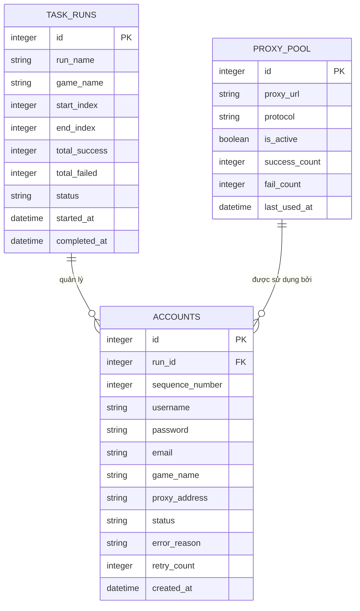

# Đặc Tả Cơ Sở Dữ Liệu Cục Bộ (Local SQLite Database Specification)

Hệ thống sử dụng cơ sở dữ liệu **SQLite** gọn nhẹ dạng tệp cục bộ (`storage/database.sqlite`) nhằm lưu trữ toàn bộ trạng thái thực thi, lịch sử tài khoản, quản lý proxy và hỗ trợ khôi phục tiến trình (Resume) khi gặp sự cố.

---

## 1. Sơ Đồ Thực Thể - Quan Hệ (ER Diagram)



---

## 2. Chi Tiết Các Bảng Dữ Liệu (Schema DDL)

### 2.1 Bảng `task_runs` (Quản lý các đợt chạy)
Lưu thông tin tổng quan của mỗi phiên chạy (ví dụ: Tạo từ 1 đến 1000 cho Game A).

```sql
CREATE TABLE IF NOT EXISTS task_runs (
    id INTEGER PRIMARY KEY AUTOINCREMENT,
    run_name TEXT NOT NULL,
    game_name TEXT NOT NULL,
    start_index INTEGER NOT NULL,
    end_index INTEGER NOT NULL,
    total_success INTEGER DEFAULT 0,
    total_failed INTEGER DEFAULT 0,
    status TEXT CHECK(status IN ('RUNNING', 'PAUSED', 'COMPLETED', 'INTERRUPTED')) DEFAULT 'RUNNING',
    started_at DATETIME DEFAULT CURRENT_TIMESTAMP,
    completed_at DATETIME
);
```

### 2.2 Bảng `accounts` (Chi tiết từng tài khoản)
Lưu vết trạng thái từng tài khoản từ lúc sinh ra đến khi đăng ký thành công hoặc thất bại.

```sql
CREATE TABLE IF NOT EXISTS accounts (
    id INTEGER PRIMARY KEY AUTOINCREMENT,
    run_id INTEGER REFERENCES task_runs(id) ON DELETE CASCADE,
    sequence_number INTEGER NOT NULL,
    username TEXT NOT NULL,
    password TEXT NOT NULL,
    email TEXT NOT NULL,
    game_name TEXT NOT NULL,
    proxy_address TEXT,
    status TEXT CHECK(status IN ('PENDING', 'SUCCESS', 'FAILED', 'TIMEOUT')) DEFAULT 'PENDING',
    error_reason TEXT,
    retry_count INTEGER DEFAULT 0,
    created_at DATETIME DEFAULT CURRENT_TIMESTAMP,
    UNIQUE(username, game_name)
);

-- Chỉ mục tối ưu truy vấn Resume
CREATE INDEX IF NOT EXISTS idx_accounts_game_seq ON accounts (game_name, sequence_number);
CREATE INDEX IF NOT EXISTS idx_accounts_status ON accounts (status);
```

### 2.3 Bảng `proxy_pool` (Quản lý danh sách Proxy)
Theo dõi sức khỏe của từng Proxy để loại bỏ proxy chết, giữ lại proxy sạch.

```sql
CREATE TABLE IF NOT EXISTS proxy_pool (
    id INTEGER PRIMARY KEY AUTOINCREMENT,
    proxy_url TEXT UNIQUE NOT NULL,
    protocol TEXT DEFAULT 'http', -- http, https, socks5
    is_active BOOLEAN DEFAULT 1,
    success_count INTEGER DEFAULT 0,
    fail_count INTEGER DEFAULT 0,
    last_used_at DATETIME
);
```

---

## 3. Các Truy Vấn Nghiệp Vụ Cốt Lõi (Core Queries)

### 3.1 Kiểm tra điểm Resume (Tiếp tục khi khởi động lại)
```sql
-- Lấy số thứ tự lớn nhất đã thành công để chạy tiếp
SELECT COALESCE(MAX(sequence_number), 0) + 1 AS next_index
FROM accounts
WHERE game_name = :game_name AND status = 'SUCCESS';
```

### 3.2 Thống kê báo cáo tiến độ thời gian thực
```sql
SELECT 
    status, 
    COUNT(*) as count 
FROM accounts 
WHERE run_id = :run_id 
GROUP BY status;
```
