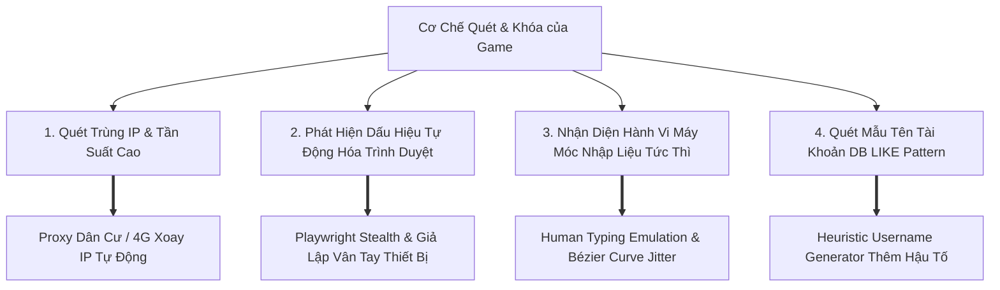

# Đặc Tả Kỹ Thuật Phòng Vệ Chống Ban (Anti-Detection & Security Strategy)

Tài liệu này chi tiết hóa các giải pháp kỹ thuật nhằm vô hiệu hóa các thuật toán phát hiện bot, quét tự động và cơ chế khóa tài khoản hàng loạt (Anti-Cheat / Anti-Bot) của nhà phát hành game.

---

## 1. Các Mối Đe Dọa Nhận Diện & Giải Pháp Kỹ Thuật

---

## 2. Chi Tiết Các Lớp Phòng Vệ

### 2.1 Quản Lý Địa Chỉ Mạng (IP & Proxy Strategy)
- **Vấn đề**: Tạo từ 3 - 5 tài khoản liên tục từ cùng một IP gia đình (Data Center IP) sẽ lập tức kích hoạt tường lửa Cloudflare/Akamai, trả về mã HTTP 429 hoặc khóa vĩnh viễn (IP Ban).
- **Giải pháp**:
  - Hỗ trợ kết nối qua **Proxy Dân cư (Residential Proxy)** hoặc **Proxy 4G/Dcom xoay IP**.
  - Áp dụng cơ chế **Sticky Session theo từng tài khoản**: Một tài khoản từ lúc mở trang -> nhận mail -> submit form sẽ giữ nguyên 1 IP duy nhất.
  - Xoay IP sang địa chỉ mới sau mỗi `N` tài khoản thành công (Cấu hình mặc định: 1 - 2 tài khoản / 1 IP).
  - Tự động kiểm tra sức khỏe IP trước khi thực hiện tác vụ (Health check qua `api.ipify.org`).

### 2.2 Giả Lập Dấu Vân Tay Trình Duyệt (Browser Fingerprint Spoofing)
- **Vấn đề**: Các hệ thống bảo mật quét các cờ nội bộ của Chromium:
  - `navigator.webdriver === true`
  - Thuộc tính `chrome.runtime` bị thiếu.
  - Canvas Fingerprint và WebGL Hash đồng nhất giữa 1000 phiên chạy.
- **Giải pháp**:
  - Tích hợp thư viện `playwright-stealth` để xóa bỏ hoàn toàn dấu vết tự động hóa.
  - Tiêm mã Script ngẫu nhiên hóa Canvas Hash và AudioContext nhẹ trên từng Browser Context.
  - Thay đổi linh hoạt độ phân giải màn hình (Viewport) ngẫu nhiên giữa các chuẩn phổ thông: `1920x1080`, `1366x768`, `1536x864`, `1440x900`.
  - Luân phiên danh sách User-Agent của các phiên bản Chrome / Edge thực tế gần nhất.

### 2.3 Mô Phỏng Hành Vi Con Người (Human Behavioral Simulation)
- **Tốc độ gõ phím (Keystroke Delay)**: Không sử dụng hàm `.fill()` tức thì của trình duyệt. Sử dụng hàm `.type()` hoặc hàm mô phỏng phím bấm với độ trễ biến thiên:
  $$Delay = Random(60ms, 140ms) + Jitter$$
  Thỉnh thoảng có xác suất 2% gõ nhầm một ký tự, dừng 300ms rồi bấm phím `Backspace` xóa đi gõ lại để mô phỏng người thật tuyệt đối.
- **Thời gian chờ ngẫu nhiên (Random Jitter)**: Thêm khoảng nghỉ ngẫu nhiên 2 - 5 giây giữa các hành động (như từ lúc điền xong password đến lúc bấm gửi OTP).

### 2.4 Sinh Tên Tài Khoản Thông Minh (Heuristic Naming Pattern)
- Không nên chỉ đặt tên thuần túy cứng nhắc như `bot1`, `bot2`, ..., `bot1000`.
- Hỗ trợ chế độ chèn chuỗi ký tự ngẫu nhiên nhẹ:
  `{prefix}_{sequence}_{random_hash}` (Ví dụ: `hero_0001_a9`, `hero_0002_k4`).
- Giúp tài khoản an toàn trước các đợt quét thủ công bằng câu lệnh SQL từ quản trị viên game.
