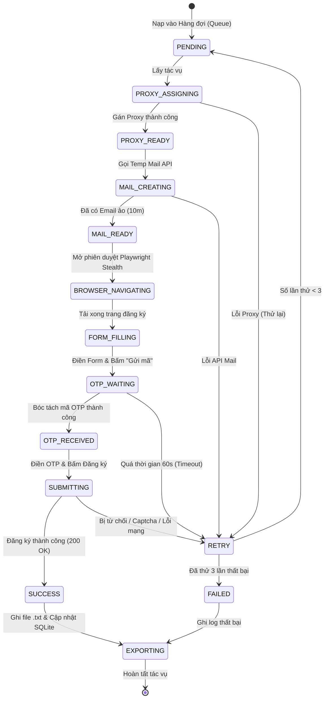
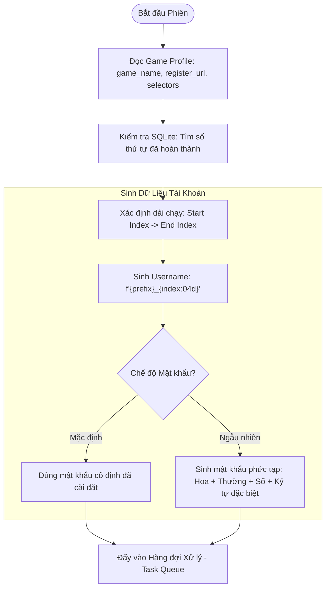
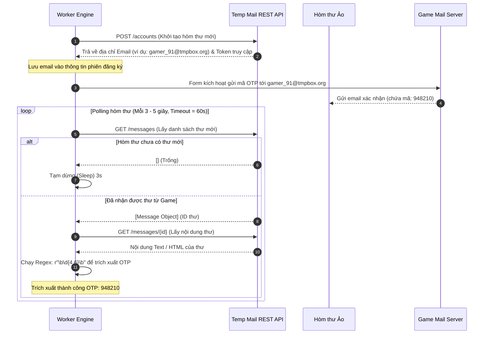
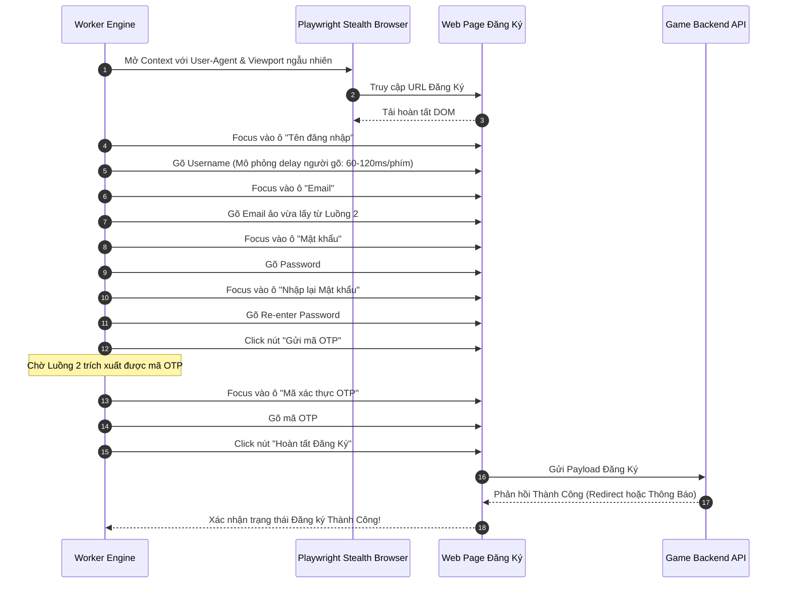
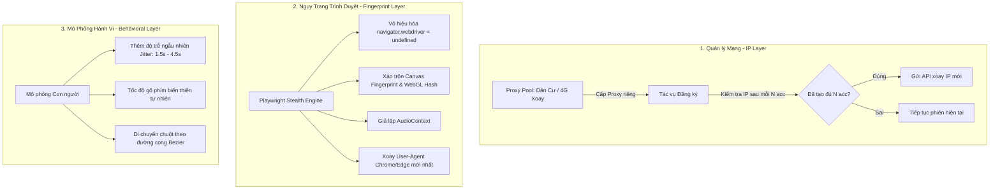
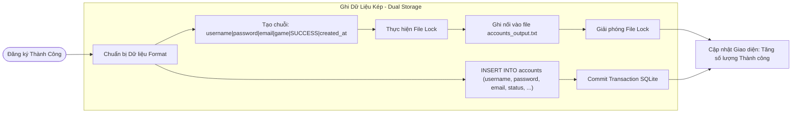

# Đặc Tả Luồng Nghiệp Vụ Toàn Diện (Account Creation Workflows)

Tài liệu này trực quan hóa toàn bộ chu trình hoạt động của hệ thống **Game Account Automation Engine**. Các luồng được thiết kế dạng module khép kín, có sơ đồ tương tác rõ ràng giúp người vận hành và AI Agent dễ dàng theo dõi, giám sát và gỡ lỗi.

---

## 1. Sơ Đồ Máy Trạng Thái Toàn Cục (Global State Machine)

Mỗi tài khoản từ dải số `1 đến 1000` sẽ trải qua một chu trình chuyển đổi trạng thái nghiêm ngặt dưới đây:



---

## 2. Chi Tiết 5 Luồng Hoạt Động Cốt Lõi

### 🔹 Luồng 1: Generator & Profile Configuration (Sinh ID 1-1000 & Hồ Sơ Game)

Luồng này chịu trách nhiệm chuẩn bị nguyên liệu đầu vào cho toàn bộ chu trình.



* **Quy tắc sinh Username**:
  * Tùy biến mẫu: `{prefix}_{index:04d}` (Ví dụ: `valiant_0001` đến `valiant_1000`).
  * Có tùy chọn thêm hậu tố ngẫu nhiên (ví dụ: `valiant_0001_k8`) nhằm vô hiệu hóa các câu lệnh quét hàng loạt của Game Master (ví dụ: `SELECT * FROM users WHERE username LIKE 'valiant_%'`).
* **Hồ sơ Game (Game Profiles)**:
  * Lưu trữ độc lập tại `configs/game_profiles.json`, cho phép dùng chung 1 tool cho nhiều tựa game khác nhau chỉ bằng cách thay đổi cấu hình selector.

---

### 🔹 Luồng 2: Temp Mail Service & Auto OTP Extractor (Mail Ảo & Bóc Tách Mã)

Quy trình tự động hóa tương tác với dịch vụ email tạm thời thông qua REST API tốc độ cao:



* **Xử lý sự cố (Error Handling)**:
  * Nếu quá 60s không thấy thư về -> Đánh dấu `MAIL_TIMEOUT`, hủy email hiện tại và cấp email mới để thử lại.

---

### 🔹 Luồng 3: Registration Engine & Form Automation (Tự Động Điền Form)

Sử dụng **Playwright Stealth** điều khiển trình duyệt không để lại dấu vết tự động hóa:



---

### 🔹 Luồng 4: Lớp Phòng Vệ Chống Ban (Anti-Detection & Evasion Strategy)

Đây là lớp phòng thủ cốt lõi để đảm bảo tool chạy an toàn 1000 tài khoản mà không bị chặn dải IP hoặc bị khóa tài khoản hàng loạt:



---

### 🔹 Luồng 5: State Persistence & Exporter (Quản lý Tiến Trình & Xuất Dữ Liệu)

Đảm bảo an toàn dữ liệu, chống mất mát khi gặp sự cố phần cứng, mất điện hoặc đứt cáp mạng:



* **Định dạng file xuất chuẩn `.txt`**:
  ```text
  dragon_0001|PassSecret123@|vnl_84920@tmpmail.com|VõLâmTruyềnKỳ|SUCCESS|2026-09-21 11:05:12
  dragon_0002|PassSecret123@|vnl_19284@tmpmail.com|VõLâmTruyềnKỳ|SUCCESS|2026-09-21 11:05:45
  ```
* **Cơ chế Tiếp tục khi khởi động lại (Resume Mechanism)**:
  * Khi khởi động lại, tool tự động kiểm tra cơ sở dữ liệu `local_store.db`:
    `SELECT MAX(sequence_number) FROM accounts WHERE game_name = 'VõLâmTruyềnKỳ' AND status = 'SUCCESS'`
  * Nếu tìm thấy số `452`, tool tự động bắt đầu từ số `453`, bỏ qua các tài khoản đã tạo thành công trước đó.

---

## 3. Ma Trận Xử Lý Lỗi & Kịch Bản Phục Hồi (Error Matrix & Recovery)

| Tình Huống Lỗi | Nguyên Nhân Phổ Biến | Hành Động Phục Hồi Tự Động của Tool |
| :--- | :--- | :--- |
| **Email Timeout (>60s)** | Server game gửi mail chậm hoặc hòm thư ảo bị nghẽn | Hủy hòm thư hiện tại, tạo hòm thư ảo mới, bấm "Gửi lại mã" (Thử tối đa 2 lần). |
| **IP Rate Limit (HTTP 429)** | Tạo quá nhiều tài khoản trên 1 địa chỉ IP | Kích hoạt xoay Proxy ngay lập tức, tạm dừng (Sleep) 30s trước khi thử lại tài khoản đó. |
| **Tên tài khoản đã tồn tại** | Đã có người khác đăng ký username này | Tự động thêm hậu tố ngẫu nhiên (ví dụ: `_x1`) và thử đăng ký lại ngay lập tức. |
| **Phát hiện Captcha (Turnstile/reCAPTCHA)** | Hành vi bị nghi ngờ bot | Kích hoạt Module Giải Captcha (2Captcha/Capsolver API) hoặc thông báo người dùng can thiệp thủ công. |
| **Mất kết nối mạng / Crash tool** | Sự cố môi trường máy tính | Khi bật lại tool, SQLite tự động nạp vị trí lưu gần nhất và tiếp tục chạy bình thường. |
